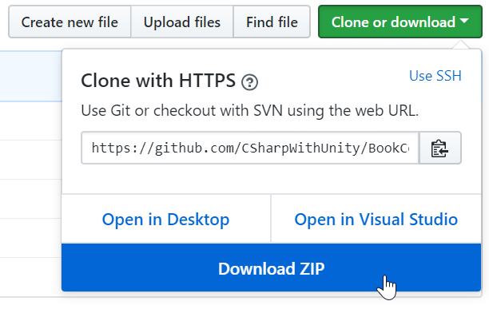

# Chapter 2
The links you'll need are here:

+ The Contents for the book: [Book Contents](https://github.com/CSharpWithUnity/BookContents)
+ The Unity Editor: [Unity Hub](https://store.unity.com/)
+ Git Source Control: [GitSCM](https://git-scm.com/)

The contents can be downloaded from here as a Zip: 

You can also create a new GitHub account then create a private fork of the repo using the same popup window.

